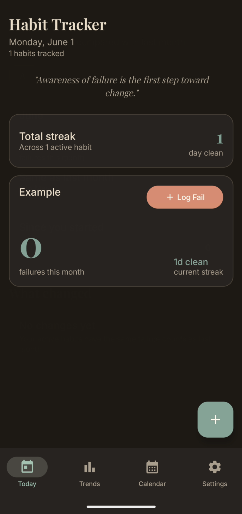
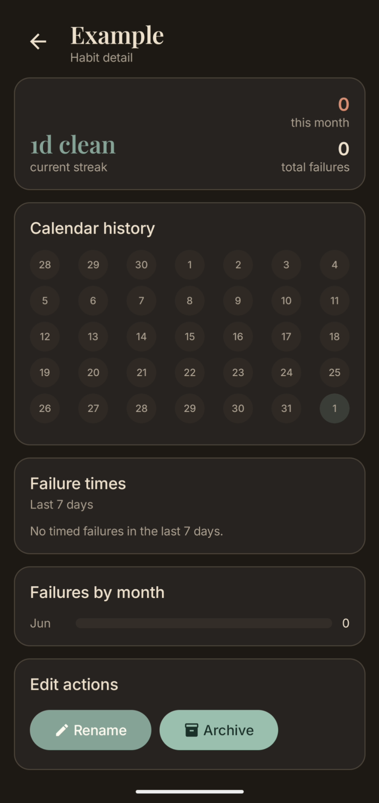
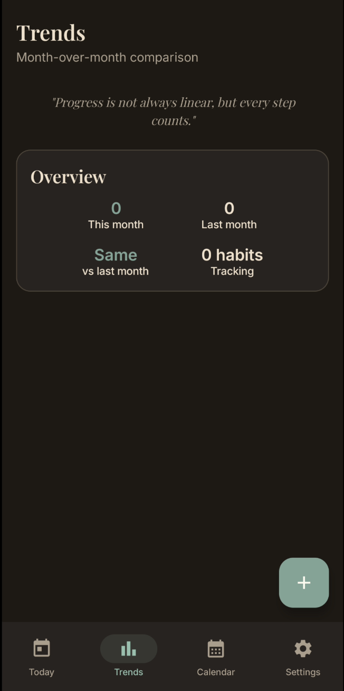
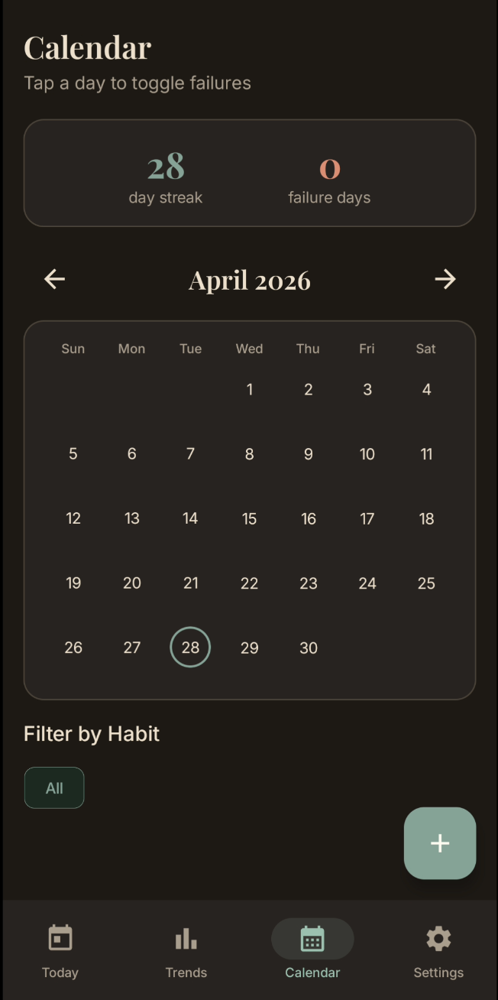
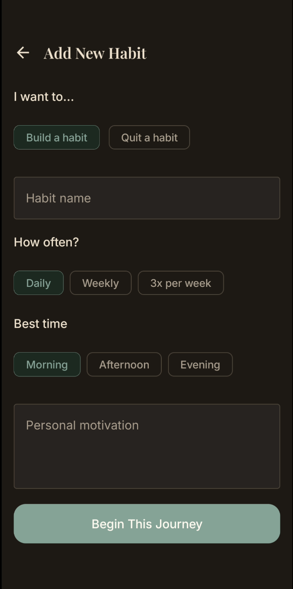
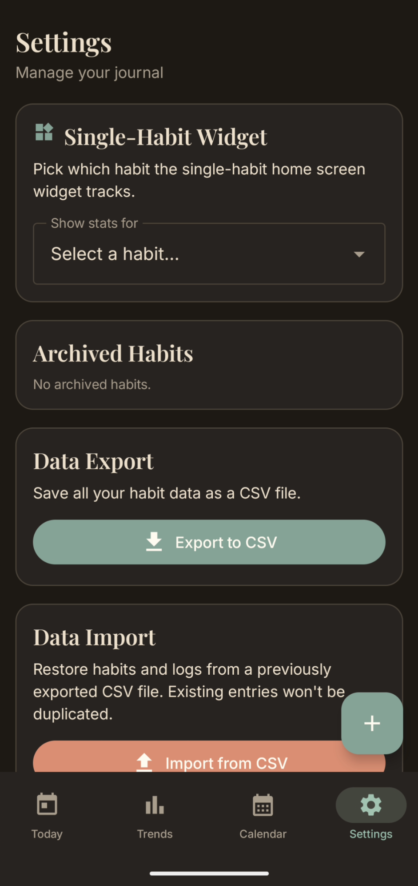

# Habit Tracker

A minimalist Android habit tracker. Track habits you're trying to build or quit, log failures, and review your progress over time.

[](https://github.com/reveny)
[](https://github.com/reveny/Android-Habit-Tracker/releases/latest)
[](https://github.com/reveny/Android-Habit-Tracker/releases/)
[](https://t.me/reveny1)
[](https://github.com/reveny/Android-Habit-Tracker/actions/workflows/build.yml)

## Screenshots

<div align="center">
  <table>
    <tr>
      <td align="center"></td>
      <td align="center"></td>
      <td align="center"></td>
      <td align="center"></td>
      <td align="center"></td>
      <td align="center"></td>
    </tr>
    <tr>
      <td align="center">Today</td>
      <td aligns="center">Habit Details</td>
      <td align="center">Trends</td>
      <td align="center">Calendar</td>
      <td align="center">Add Habit</td>
      <td align="center">Settings</td>
    </tr>
  </table>
</div>

## Features

- Track habits you want to **build** or **quit**, each with an optional motivation note
- Log failures against any date using a date picker
- Month-over-month failure count comparison per habit and across all habits
- Calendar view with failure days highlighted, tap any day to toggle a failure
- Filter the calendar by a specific habit
- Long-press any habit card to **rename** or **delete** it
- Two home screen widgets: one for a single chosen habit, one for all habits combined
- Both widgets show failure count and clean streak, and adapt to light and dark mode
- Export all data to CSV
- Import data from a previously exported CSV
- Full dark mode support following the system theme

## Todo

- [x] App icon
- [ ] F-Droid publication

### Home Screen Widgets
Two widgets available from the Android widget picker:

| Widget | Description |
|---|---|
| **Single-habit** | Shows failure count and clean streak for one habit selected in Settings |
| **All habits** | Shows combined failure count and clean streak across all active habits |

Both widgets adapt to light and dark mode and refresh automatically when data changes.

## Contributing

Contributions are welcome! If you feel like something is missing or could be better, the easiest way is to just open an issue and describe what you have in mind. If you already know what you want to do, feel free to skip the issue and go straight to a pull request.

There are no strict contribution guidelines, just try to keep the code style consistent with what's already there.

## Contact

- [GitHub Issues](https://github.com/reveny/Android-Habit-Tracker/issues)
- Email: contact@reveny.me
- Telegram Contact: https://t.me/revenyy
- Telegram Group: https://t.me/reveny1

## License

```
Copyright 2026 Reveny

Licensed under the MIT License (the "License");
you may not use this file except in compliance with the License.

Permission is hereby granted, free of charge, to any person obtaining a copy
of this software and associated documentation files (the "Software"), to deal
in the Software without restriction, including without limitation the rights
to use, copy, modify, merge, publish, distribute, sublicense, and/or sell
copies of the Software, and to permit persons to whom the Software is
furnished to do so, subject to the following conditions:

The above copyright notice and this permission notice shall be included in all
copies or substantial portions of the Software.

THE SOFTWARE IS PROVIDED "AS IS", WITHOUT WARRANTY OF ANY KIND, EXPRESS OR
IMPLIED, INCLUDING BUT NOT LIMITED TO THE WARRANTIES OF MERCHANTABILITY,
FITNESS FOR A PARTICULAR PURPOSE AND NONINFRINGEMENT. IN NO EVENT SHALL THE
AUTHORS OR COPYRIGHT HOLDERS BE LIABLE FOR ANY CLAIM, DAMAGES OR OTHER
LIABILITY, WHETHER IN AN ACTION OF CONTRACT, TORT OR OTHERWISE, ARISING FROM,
OUT OF OR IN CONNECTION WITH THE SOFTWARE OR THE USE OR OTHER DEALINGS IN THE
SOFTWARE.
```
